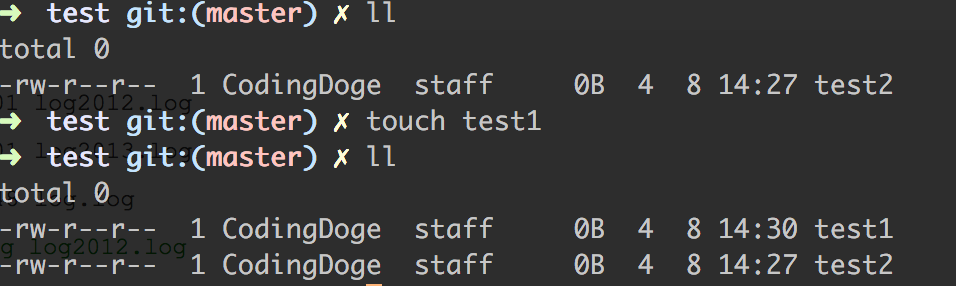

# [Unix Shell Command] touch
## 作用
touch是一个被用于更改文件访问和修改时间的标准UNIX程序，它也被用于创建新文件。
## 使用格式
touch [OPTION]... FILE...
## 命令参数
**-a**, 只更改访问时间
**-c**, 如果文件不存在，不创建且不声明
**-d**, 使用指定的日期时间，而非现在的时间
**-f**, 此参数将忽略不予处理，仅负责解决BSD版本touch指令的兼容性问题
**-h**, [已废弃]
**-m**,  只更改修改时间
**-r file**,  使用file的访问、修改时间而非当前时间
**-t time**, 使用time（格式见下）更改访问、修改时间
> **time**的格式为[[cc]yy]MMDDhhmm[.ss]，其中cc代表世纪，yy代表年份的后二位数字，MM代表月份，DD代表天数，hh代表小时，mm代表分钟，ss代表秒数  

**—help** , 显示帮助信息
**—version**, 显示版本信息
## 使用示例
1. 创建新文件[如果当前文件不存在则创建一个]
` touch test1`

2. 更新一个文件和另外一个文件的时间戳相同
` touch -r test1 test2`

> 将`test1`的时间戳修改成`test2`的  

3. 设定文件的时间戳
`touch -t 201704081207.17 test1`
> 将test1的时间戳修改成输入的时间戳  

