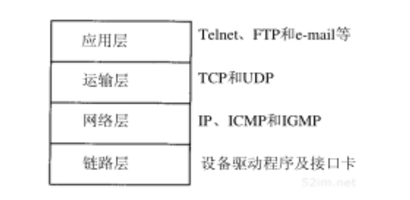
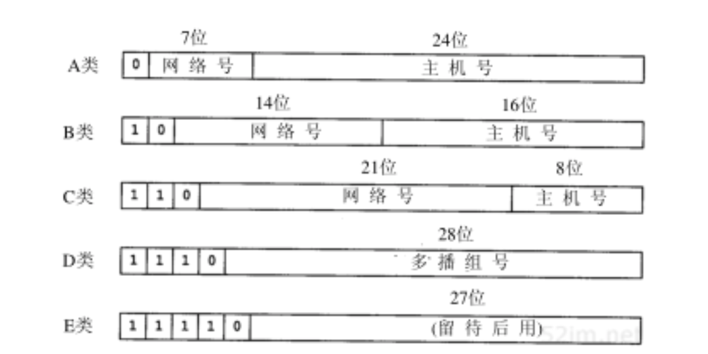
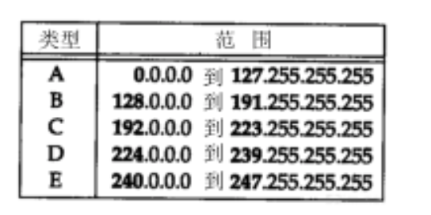

# [《TCP/IP详解》笔记—第1章 概述](http://docs.52im.net/extend/docs/book/tcpip/vol1/1/)
> 一个互连网就是一组通过相同协议族互连在一起的网络。  

## 分层
TCP/IP通常被认为是一个四层协议系统:

网络层和运输层之间的区别是最为关键的：网络层（IP）提供点到点的服务，而运输层（TCP和UDP）提供端到端的服务。

在TCP/IP协议族中，网络层IP提供的是一种不可靠的服务。也就是说，它只是尽可能快地把分组从源结点送到目的结点，但是并不提供任何可靠性保证。而另一方面，TCP在不可靠的IP层上提供了一个可靠的运输层。为了提供这种可靠的服务，TCP采用了超时重传、发送和接收端到端的确认分组等机制。

路由器为不同类型的物理网络提供连接。

一个主机也可以有多个接口，但一般不称作路由器,除非它的功能只是单纯地把分组从一个接口传送到另一个接口。

互联网的目的之一是在应用程序中隐藏所有的物理细节。

连接网络的另一个途径是使用网桥。网桥是在链路层上对网络进行互连，而路由器则是在网络层上对网络进行互连。

## 互联网的地址

这些 32 位的地址通常写成四个十进制的数,其中每个整数对应一个字节。这种表示方法称作“点分十进制表示法(Dotted decimal notation)”。

## 封装
TCP传给IP的数据单元称作TCP报文段或简称为TCP段（TCP segment）。IP传给网络接口层的数据单元称作IP数据报(IP datagram)。通过以太网传输的比特流称作帧(Frame)。
## 分用
当目的主机收到一个以太网数据帧时，数据就开始从协议栈中由底向上升，同时去掉各层协议加上的报文首部。每层协议盒都要去检查报文首部中的协议标识，以确定接收数据的上层协议。这个过程称作分用（Demultiplexing）。
## 客户-服务器模型
大部分网络应用程序在编写时都假设一端是客户，另一端是服务器，其目的是为了让服务器为客户提供一些特定的服务。
一般来说，TCP服务器是并发的，而UDP服务器是重复的。

## 习题
1. 请计算最多有多少个A类、B类和C类网络号。
2. 用匿名FTP（见27.3节）从主机nic.merit.edu上获取文件nsfnet_statistics_history.netcount。该文件包含在NSFNET网络上登记的国内和国外的网络数。画一坐标系，横坐标代表年，纵坐标代表网络总数的对数值。纵坐标的最大值是习题1.1的结果。如果数据显示一个明显的趋势，请估计按照当前的编址体制推算，何时会用完所有的网络地址（3.10节讨论解决该难题的建议）。
3. 获取一份主机需求**RFC**拷贝[Braden 1989a]，阅读有关应用于TCP/IP协议族每一层的稳健性原则。这个原则的参考对象是什么？
4. 获取一份最新的赋值**RFC**拷贝。“quote of the day”协议的有名端口号是什么？哪个**RFC**对该协议进行了定义？
5. 如果你有一个接入TCP/IP互联网的主机帐号，它的主IP地址是多少？这台主机是否接入了Internet？它是多接口主机吗？
6. 获取一份**RFC** 1000的拷贝，了解RFC这个术语从何而来。
7. 与**Internet**协会联系，isoc@isoc.org或者**+170 3648 9888**，了解有关加入的情况。
8. 用匿名FTP从主机is.internic.net处获取文件about-internic/information-about-the-internic。

## 部分习题答案
1. 答案是：27-2（126）＋214-2（16 382）＋221-2（2 097 150）=2 113 658。每一部分都减去2是因为全0或全1网络ID是非法的。
2. 图D-1显示了直到1993年8月的有关数据。如果网络数继续呈指数增长的话，虚线估计了2000年可能达到的最大的网络数。
3. “自由地接收，保守地发送。”

> 资料来源于 [即时通讯网](http://www.52im.net/)，仅做学习参考  

