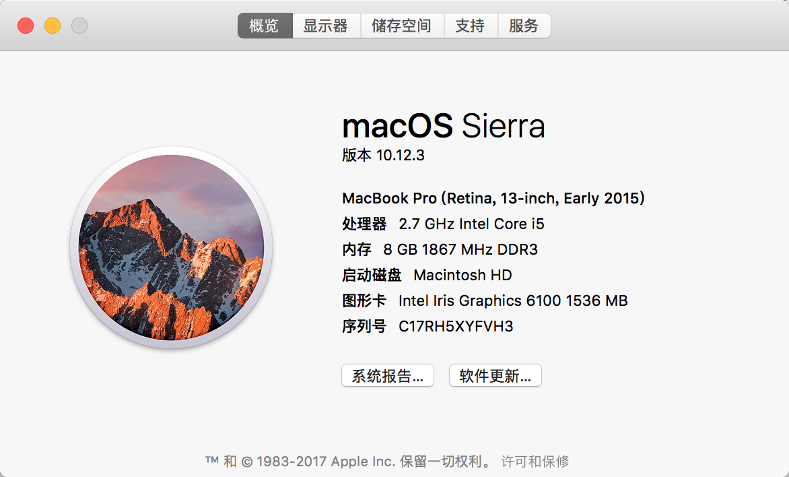
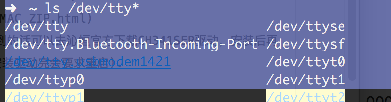

# 解决Arduino CH34x系列在macOS Sierra中找不到串口的问题(综合全网的方案)

> 毕设做Arduino开发，一开始买了淘宝上慧净自己改的Arduino UNO国产板子，回来插在mac上读不出串口，安装了它附带的驱动还是读不出，同学买了原装板说一插上就能读出串口，都没自己装驱动，为了省麻烦，直接跟商家换了原装板，这时候麻烦来了，板子在我电脑上读不出串口，在别人电脑上能读出来，别人的在我电脑上也读不出来…很崩溃，然后从各个角度debug，下面一个个步骤来，基本能解决。  
 

1. 安装[Arduino IDE](https://www.arduino.cc/en/Main/Software)
上面是官网IDE下载的连接，大概是因为GFW的原因下载速度奇慢，大家也可以去搜Arduino中文社区，里面有好人做了*度网盘的下载种子，速度能快点。  
IDE一般自带驱动，如果在串口里没发现，可以试试在


这个系统报告里看看USB下面能不能读出

也可以在bash里输入
``` ls /dev/tty* ```  
```
如果有类似的即可



1. [官方驱动下载](http://www.wch.cn/download/CH341SER_MAC_ZIP.html)
如果都找不到的话可以去沁恒官方下载CH341SER驱动，安装后再查看一遍(安装驱动完会要求重启).

1. 更改SIP设置
> Apple在10.11中全面启用了名为 System Integrity Protection (SIP) 的系统完整性保护技术. 受此影响, 未经签名的第三方kext及经过修改的原版kext将无法正常加载, 大部分系统文件即使在root用户下也无法直接进行修改.    

前面安装驱动不成功大部分是因为驱动文件冲突导致，所以在此之前先删除之前安装的驱动文件:
``` sudo rm -rf /System/Library/Extensions/usb.kext ```
``` sudo rm -rf /Library/Extensions/usbserial.kext ```
``` sudo rm -rf _private_var_db_receipts/com.wch.* ```

然后参考[CH340 CH341 serial adapters fix for El Capitan OS X](https://tzapu.com/making-ch340-ch341-serial-adapters-work-under-el-capitan-os-x/)可以通过以下步骤修改SIP设置来安装第三方kext:
1. 重启OS X 并且立即按住 Command+ R 来来进入恢复模式
2. 在恢复模式中, 菜单栏上面找到终端(Terminal)并打开
3. 在终端中键入命令``` csrutil enable —without kext ```
4. 看到成功的提示信息之后, 输入reboot重启系统
> 注: ```—without kext 中的``` - 有两条  
> Command 就是 ⌘ 图标  

通过以上的操作之后, 采用CH340/1 系列芯片的Arduino开发板又可以被识别出来了. 如果还是无法识别, 请重新安装一次CH341SER驱动.

1. 最后如果还不行(我的就是到这里还不行)，请看看你的板子是否接触不良，反复摩擦尝试看能不能读出串口，我之前也试过这个办法，但是没有用，后面偶然也是必然下反应过来，反反复复插USB拔出查看串口状态，终于解决了(无良商家害人)


