# 常见排序算法总结

排序算法一般分为：
1. 内部排序(In-place sort)
    不占用额外内存或者占用常数内存，如：插入排序、选择排序、冒泡排序、堆排序、快速排序。
2. 外部排序(Out-place sort)
    因为排序数据大，可用内存一次不能容纳所有排序记录，排序过程中需要访问外存，如：归并排序、计数排序、基数排序、桶排序。
    
也分为：
1. 稳定的排序(stable sort)
    插入排序、冒泡排序、归并排序、计数排序、基数排序、桶排序。
2. 不稳定的排序(unstable sort)
    选择排序、快速排序、堆排序。
> 算法的稳定性：假定在待排序的记录序列中，存在多个具有相同的关键字的记录，若经过排序，这些记录的相对次序保持不变，即在原序列中，ri=rj，且ri在rj之前，而在排序后的序列中，ri仍在rj之前，则称这种排序算法是稳定的；否则称为不稳定的。  
> ***
> 不稳定算法的改进：只需要在每个输入元素加一个index，表示初始时的数组索引，当不稳定的算法排好序后，对于相同的元素对index排序即可。


## 插入排序

最优复杂度：当输入数组就是排好序的时候，复杂度为O(n)，而快速排序在这种情况下会产生O(n^2)的复杂度。
最差复杂度：当输入数组为倒序时，复杂度为O(n^2)。
> 插入排序比较适合用于“少量元素的数组”。插入排序比较适合用于“少量元素的数组”。

### 1.直接插入排序（Straight Insertion Sort）
***
工作原理是通过构建有序序列，对于未排序数据，在已排序序列中从后向前扫描，找到相应位置并插入。具体算法描述如下：

1. 从第一个元素开始，该元素可以认为已经被排序
2. 取出下一个元素，在已经排序的元素序列中从后向前扫描
3. 如果该元素（已排序）大于新元素，将该元素移到下一位置
4. 重复步骤3，直到找到已排序的元素小于或者等于新元素的位置
5. 将新元素插入到该位置后
6. 重复步骤2~5

直接插入排序示例：
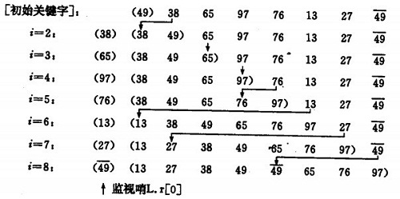
> 如果排序时碰到相等的元素，比较后会把相等的元素放在后面，所以这两个相等的元素之间的前后顺序没有改变，排序是稳定的。

算法的实现：

```
void InsertSort(int a[], int n)  
{  
    for(int i = 1; i < n; i++)
    {  
        if(a[i] < a[i-1])   //若第i个元素大于i-1元素，直接插入。小于的话，移动有序表后插入  
        {               
            int j = i-1;   
            int temp = a[i];    //存储待排序元素  
            a[i] = a[i-1];      //先后移一个元素  
            while(x < a[j] && j >= 0)     //查找在有序表中的插入位置，并注意边界判断
            {   
                a[j+1] = a[j];  
                j--;         //元素后移  
            }  
            a[j+1] = temp;      //插入到正确位置  
        }          
    }  
      
}
```
> 如果比较操作的代价比交换操作大的话，可以采用二分查找法来减少比较操作的数目。直接插入排序算法的优化算法有：二分插入排序，2-路插入排序。

### 2.希尔排序（Shell's Sort）
***
希尔排序，也称递减增量排序算法，是插入排序的一种更高效的改进版本。它是基于插入排序的以下两点性质而提出改进方法的：

- 插入排序在对几乎已经排好序的数据操作时，效率高，即可以达到线性排序的效率
- 但插入排序一般来说是低效的，因为插入排序每次只能将数据移动一位

基本原理是先将整个待排序的记录序列分割成为若干子序列分别进行直接插入排序，待整个序列中的记录“基本有序”时，再对全体记录进行依次直接插入排序。算法具体描述如下：

1. 选择一个步长，其设计者Donald Shell最初建议步长选择为**n/2**并且对步长取半直到步长达到1；
2. 以步长为间隔对序列进行排序；
3. 重复步骤2直到步长为1。

希尔排序的示例：
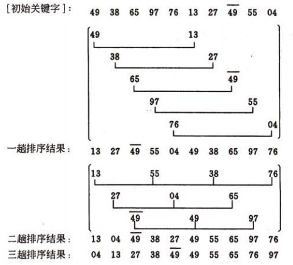
> 希尔排序是不稳定的。

算法的实现：

```
void ShellInsertSort(int a[], int n)
{
	for (int gap=n>>1; gap>0; gap>>=1) // 确定步长，直到步长为1
	{
		for (int i=gap; i<n; i++) // 以步长为间隔进行排序
		{
			int temp = a[i];
			int j;
			for (j=i-gap; j>=0&&a[j]>temp; j-=gap)   // 排序细节
				a[j+gap] = a[j];
			a[j+gap] = temp;
		}
	}
}
```

可能希尔排序最重要的地方在于当用较小步长排序后，以前用的较大步长仍然是有序的。已知的最好步长序列是由Sedgewick提出的(1, 5, 19, 41, 109,...)，该序列的项来自两个算式[[1]](http://faculty.simpson.edu/lydia.sinapova/www/cmsc250/LN250_Weiss/L12-ShellSort.htm#increments)。这项研究也表明“比较在希尔排序中是最主要的操作，而不是交换。”用这样步长序列的希尔排序比插入排序要快，甚至在小数组中比快速排序和堆排序还快，但是在涉及大量数据时希尔排序还是比快速排序慢。

## 选择排序


### 简单选择排序（Simple Selection Sort）
***
基本原理是在要排序的一组数中，选出最小（或者最大）的一个数与第1个位置的数交换；然后在剩下的数当中再找最小（或者最大）的与第2个位置的数交换，依次类推，直到第n-1个元素（倒数第二个数）和第n个元素（最后一个数）比较为止。算法的具体描述如下：

1. 第一趟，从n 个记录中找出关键码最小的记录与第一个记录交换；
2. 第二趟，从第二个记录开始的n-1 个记录中再选出关键码最小的记录与第二个记录交换；

3. 以此类推.....

4. 第i趟，则从第i 个记录开始的n-i+1 个记录中选出关键码最小的记录与第i 个记录交换，

直到整个序列按关键码有序。

简单选择排序的示例：
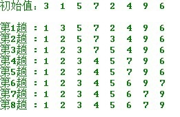
算法实现：

```
void SelectSort(int a[], int n)
{
	int min = a[0];
	for (int i = 0; i < n; i++)
	{
		for (int j = i; j < n; j++)	// 每次选出序列中最小的数
			if (a[j] < min)
				min = a[j];
		a[i] = min;	// 将每次选好的数放在正确的位置
	}
}
```
> 选择排序是稳定的。

选择排序的交换操作介于**0**和**(n-1)**次之间。选择排序的比较操作为**n(n-1)**次之间。选择排序的赋值操作介于**0**和**3(n-1)**次之间。
比较次数**O(n^2 )**，比较次数与关键字的初始状态无关，总的比较次数**N=(n-1)+(n-2)+...+1=n(n-1)/2**。交换次数**O(n)**，最好情况是，已经有序，交换**0**次；最坏情况是，逆序，交换**n-1**次。交换次数比冒泡排序较少，由于交换所需CPU时间比比较所需的CPU时间多，**n**值较小时，选择排序比冒泡排序快。
原地操作几乎是选择排序的唯一优点，当空间复杂度要求较高时，可以考虑选择排序；实际适用的场合非常罕见。

#### 简单排序的改进——二元选择排序
简单选择排序，每趟循环只能确定一个元素排序后的定位。我们可以考虑改进为每趟循环确定两个元素（当前趟最大和最小记录）的位置,从而减少排序所需的循环次数。改进后对n个数据进行排序，最多只需进行[n/2]趟循环即可。具体实现如下：

```
void SelectSort(int r[],int n) {  
    int i ,j , min ,max, tmp;  
    for (i=1 ;i <= n/2;i++) {    
        // 做不超过n/2趟选择排序   
        min = i; max = i ; //分别记录最大和最小关键字记录位置  
        for (j= i+1; j<= n-i; j++) {  
            if (r[j] > r[max]) {   
                max = j ; continue ;   
            }    
            if (r[j]< r[min]) {   
                min = j ;   
            }     
      }    
      //该交换操作还可分情况讨论以提高效率  
      tmp = r[i-1]; r[i-1] = r[min]; r[min] = tmp;  
      tmp = r[n-i]; r[n-i] = r[max]; r[max] = tmp;  
    }   
}
```

### 堆排序（Heap Sort）
***

堆排序是指利用堆这种数据结构所设计的一种排序算法。其基本原理如下：
堆是一个近似完全二叉树的结构，并同时满足堆积的性质：即子结点的键值或索引总是小于（或者大于）它的父节点。
若以一维数组存储一个堆，则堆对应一棵完全二叉树，且所有非叶结点的值均不大于(或不小于)其子女的值，根结点（堆顶元素）的值是最小(或最大)的。如：

1. 大顶堆序列：（96, 83, 27, 38, 11, 09)
2. 小顶堆序列：（12, 36, 24, 85, 47, 30, 53, 91）
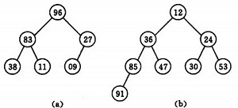  

初始时把n个数的序列看作是一棵顺序存储的二叉树（一维数组存储二叉树），调整它们的存储序，使之成为一个堆，将堆顶元素输出，得到n个元素中最小(或最大)的元素，这时堆的根节点的数最小（或者最大）。然后对前面(n-1)个元素重新调整使之成为堆，输出堆顶元素，得到n个元素中次小(或次大)的元素。依此类推，直到只有两个节点的堆，并对它们作交换，最后得到有n个节点的有序序列。称这个过程为堆排序。
因此，实现堆排序需解决两个问题：

1. 如何将n 个待排序的数建成堆；
2. 输出堆顶元素后，怎样调整剩余n-1 个元素，使其成为一个新堆。

首先讨论第二个问题：输出堆顶元素后，对剩余n-1元素重新建成堆的调整过程。调整小顶堆的方法：

1. 设有m 个元素的堆，输出堆顶元素后，剩下m-1 个元素。将堆底元素送入堆顶（（最后一个元素与堆顶进行交换），堆被破坏，其原因仅是根结点不满足堆的性质。
2. 将根结点与左、右子树中较小元素的进行交换。
3. 若与左子树交换：如果左子树堆被破坏，即左子树的根结点不满足堆的性质，则重复方法 2.
4. 若与右子树交换，如果右子树堆被破坏，即右子树的根结点不满足堆的性质。则重复方法 2.
5. 继续对不满足堆性质的子树进行上述交换操作，直到叶子结点，堆被建成。

称这个自根结点到叶子结点的调整过程为筛选。如图：
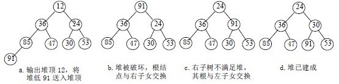

再讨论对n 个元素初始建堆的过程。
建堆方法：对初始序列建堆的过程，就是一个反复进行筛选的过程。

1. n个结点的完全二叉树，则最后一个结点是第个结点的子树。
2. 筛选从第个结点为根的子树开始，该子树成为堆。
3. 之后向前依次对各结点为根的子树进行筛选，使之成为堆，直到根结点。

如图建堆初始过程：无序序列：（49，38，65，97，76，13，27，49）
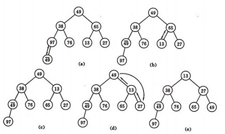

算法的实现：

```
/** 
 * 已知H[s…m]除了H[s] 外均满足堆的定义 
 * 调整H[s],使其成为大顶堆.即将对第s个结点为根的子树筛选,  
 * 
 * @param H是待调整的堆数组 
 * @param s是待调整的数组元素的位置 
 * @param length是数组的长度 
 * 
 */  
void HeapAdjust(int H[],int s, int length)  
{  
    int tmp  = H[s];  
    int child = 2*s+1; //左孩子结点的位置。(i+1 为当前调整结点的右孩子结点的位置)  
    while (child < length)
    {  
        if(child+1 <length && H[child]<H[child+1])  // 如果右孩子大于左孩子(找到比当前待调整结点大的孩子结点)  
            ++child;  
        if(H[s]<H[child])
        {  // 如果较大的子结点大于父结点  
            H[s] = H[child]; // 那么把较大的子结点往上移动，替换它的父结点  
            s = child;       // 重新设置s ,即待调整的下一个结点的位置  
            child = 2*s+1;  
        }
        else            // 如果当前待调整结点大于它的左右孩子，则不需要调整，直接退出  
             break;   
        H[s] = tmp;         // 当前待调整的结点放到比其大的孩子结点位置上  
    }   
}  

/** 
 * 初始堆进行调整 
 * 将H[0..length-1]建成堆 
 * 调整完之后第一个元素是序列的最小的元素 
 */  
void BuildingHeap(int H[], int length)  
{   
    //最后一个有孩子的节点的位置 i=  (length -1) / 2  
    for (int i = (length -1) / 2 ; i >= 0; i--)  
        HeapAdjust(H,i,length);
}  
/** 
 * 堆排序算法 
 */  
void HeapSort(int H[],int length)  
{  
    //初始堆  
    BuildingHeap(H, length);  
    //从最后一个元素开始对序列进行调整  
    for (int i = length - 1; i > 0; --i)  
    {  
        //交换堆顶元素H[0]和堆中最后一个元素  
        int temp = H[i]; H[i] = H[0]; H[0] = temp;  
        //每次交换堆顶元素和堆中最后一个元素之后，都要对堆进行调整  
        HeapAdjust(H,0,i);  
  }  
}   
```
> 堆排序是不稳定的。

设树深度为k，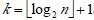。从根到叶的筛选，元素比较次数至多2(k-1)次，交换记录至多k 次。所以，在建好堆后，排序过程中的筛选次数不超过下式： 
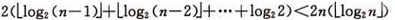
而建堆时的比较次数不超过4n 次，因此堆排序最坏情况下，时间复杂度也为：O(nlogn )。

## 交换排序
### 冒泡排序（Bubble Sort）
***

冒泡排序重复地走访过要排序的数列，一次比较两个元素，如果他们的顺序错误就把他们交换过来。
冒泡排序示例：
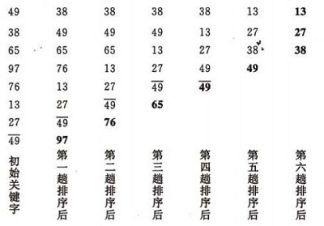
算法的实现：

```
void bubbleSort(int a[], int n)
{  
    for(int i =0 ; i< n-1; ++i)
        for(int j = 0; j < n-i-1; ++j) 
            if(a[j] > a[j+1])  
            {  
                int tmp = a[j];
                a[j] = a[j+1];
                a[j+1] = tmp;  
            } 
}
```
> 冒泡排序是稳定的。

#### 冒泡算法的改进
对冒泡排序常见的改进方法是加入一标志性变量exchange，用于标志某一趟排序过程中是否有数据交换，如果进行某一趟排序时并没有进行数据交换，则说明数据已经按要求排列好，可立即结束排序，避免不必要的比较过程。本文再提供以下两种改进算法：

1. 设置一标志性变量pos,用于记录每趟排序中最后一次进行交换的位置。由于pos位置之后的记录均已交换到位,故在进行下一趟排序时只要扫描到pos位置即可。
改进后算法如下：

```
void Bubble_1 ( int r[], int n)
{  
    int i = n -1;  //初始时,最后位置保持不变  
    while (i > 0)
    {   
        int pos= 0; //每趟开始时,无记录交换  
        for (int j = 0; j < i; j++)  
            if (r[j] > r[j+1])
            {  
                pos = j; //记录交换的位置   
                int tmp = r[j];
                r[j] = r[j+1];
                r[j+1] = tmp;  
            }   
        i = pos; //为下一趟排序作准备  
     }   
}   
```
2. 传统冒泡排序中每一趟排序操作只能找到一个最大值或最小值,我们考虑利用在每趟排序中进行正向和反向两遍冒泡的方法一次可以得到两个最终值(最大者和最小者) , 从而使排序趟数几乎减少了一半。
改进后的算法为：

```
void Bubble_2 (int r[], int n)
{  
    int low = 0;   
    int high = n-1; //设置变量的初始值  
    int tmp, j;  
    while (low < high)
    {  
        for (j = low; j < high; ++j) //正向冒泡,找到最大者  
            if (r[j] > r[j+1])
            {  
                tmp = r[j];
                r[j]=r[j+1];
                r[j+1]=tmp;  
            }   
        --high;                 //修改high值, 前移一位  
        for (j = high; j > low; --j) //反向冒泡,找到最小者  
            if (r[j] < r[j-1])
            {  
                tmp = r[j];
                r[j]=r[j-1];
                r[j-1]=tmp;  
            }  
        ++low;                  //修改low值,后移一位  
    }   
}  
```

### 快速排序（Quick Sort）
***

快速排序又称划分交换排序（partition-exchange sort），使用分治法（Divide and conquer）策略来把一个序列（list）分为两个子序列（sub-lists）。其算法描述为：

1. 从数列中挑出一个元素，称为"基准"（pivot）。
2. 重新排序数列，所有比基准值小的元素摆放在基准前面，所有比基准值大的元素摆在基准后面（相同的数可以到任一边）。在这个分区结束之后，该基准就处于数列的中间位置。这个称为分区（partition）操作。
3. 递归地（recursively）把小于基准值元素的子数列和大于基准值元素的子数列排序。

快速排序的示例：

1. 一趟排序的过程
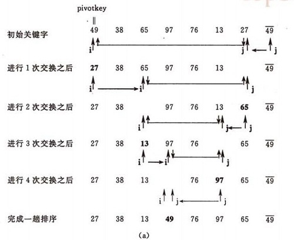

2. 排序的全过程
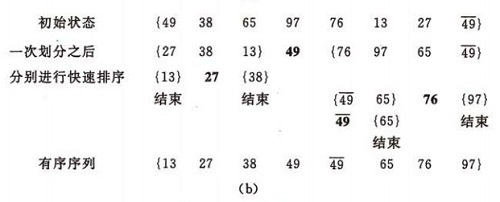

算法的实现（递归）：

```
void quickSort_recursive(int a[], int low, int high)
{
    int first = low;
    int last = high;
    int key = a[first];
    if(low >= high)
        return ;
    while(first < last)
    {
        while((first < last)&&(key <= a[last]))
            last--;
        a[first] = a[last];
        while((first < last)&&(key >= a[first]))
            first++;
        a[last] = a[first];
    }
    a[first] = key;
    quickSort_recursive(a, low, first-1);
    quickSort_recursive(a, first+1, high);
}
```
> 快速排序是不稳定的。
> 快排迭代算法:维护一个栈，存放划分的起点终点

在平均状况下，排序n个项目要Ο(nlogn)次比较。在最坏状况下（正序或逆序）则需要Ο(n^2 )次比较，取决于其递归树的高度。事实上，快速排序通常明显比其他Ο(nlogn)算法更快，因为它的内部循环（inner loop）可以在大部分的架构上很有效率地被实现出来。快速排序是一个不稳定的排序方法。

## 归并排序（Merge Sort）
***

归并（Merge）排序法是将两个（或两个以上）有序表合并成一个新的有序表，即把待排序序列分为若干个子序列，每个子序列是有序的。然后再把有序子序列合并为整体有序序列。
### 递归法
1. 将序列每相邻两个数字进行归并操作，形成floor(n/2)个序列，排序后每个序列包含两个元素
2. 将上述序列再次归并，形成floor(n/4)个序列，每个序列包含四个元素
3. 重复步骤2，直到所有元素排序完毕

算法实现：

```
void merge_sort_recursive(int arr[], int reg[], int start, int end)
{
    if (start >= end)
        return;
    int len = end - start, mid = (len >> 1) + start;
    int start1 = start, end1 = mid;
    int start2 = mid + 1, end2 = end;
    merge_sort_recursive(arr, reg, start1, end1);
    merge_sort_recursive(arr, reg, start2, end2);
    int k = start;
    while (start1 <= end1 && start2 <= end2)
        reg[k++] = arr[start1] < arr[start2] ? arr[start1++] : arr[start2++];
    while (start1 <= end1)
        reg[k++] = arr[start1++];
    while (start2 <= end2)
        reg[k++] = arr[start2++];
    for (k = start; k <= end; k++)
        arr[k] = reg[k];
}

void merge_sort(int arr[], const int len)
{
	int reg[len];
	merge_sort_recursive(arr, reg, 0, len - 1);
}
```

#### 两路归并的递归算法

```
void MSort(ElemType *r, ElemType *rf,int s, int t)  
{   
    ElemType *rf2;  
    if(s==t) r[s] = rf[s];  
    else  
    {   
        int m=(s+t)/2;          /*平分*p 表*/  
        MSort(r, rf2, s, m);        /*递归地将p[s…m]归并为有序的p2[s…m]*/  
        MSort(r, rf2, m+1, t);      /*递归地将p[m+1…t]归并为有序的p2[m+1…t]*/  
        Merge(rf2, rf, s, m+1,t);   /*将p2[s…m]和p2[m+1…t]归并到p1[s…t]*/  
    }  
}  
void MergeSort_recursive(ElemType *r, ElemType *rf, int n)  
{   /*对顺序表*p 作归并排序*/  
    MSort(r, rf,0, n-1);  
}  
```

### 迭代法
1. 申请空间，使其大小为两个已经排序序列之和，该空间用来存放合并后的序列；
2. 设定两个指针，最初位置分别为两个已经排序序列的起始位置；
3. 比较两个指针所指向的元素，选择相对小的元素放入到合并空间，并移动指针到下一位置；
4. 重复步骤3直到某一指针到达序列尾；
5. 将另一序列剩下的所有元素直接复制到合并序列尾；

算法实现：

```
void merge_sort_iteration(int arr[], int len)
{
    int* a = arr;
    int* b = new int[len];
    for (int seg = 1; seg < len; seg += seg)
    {
        for (int start = 0; start < len; start += seg + seg)
        {
            int low = start, mid = min(start + seg, len), high = min(start + seg + seg, len);
            int k = low;
            int start1 = low, end1 = mid;
            int start2 = mid, end2 = high;
            while (start1 < end1 && start2 < end2)
                b[k++] = a[start1] < a[start2] ? a[start1++] : a[start2++];
            while (start1 < end1)
                b[k++] = a[start1++];
            while (start2 < end2)
                b[k++] = a[start2++];
        }
        T* temp = a;
        a = b;
        b = temp;
    }
    if (a != arr)
    {
        for (int i = 0; i < len; i++)
            b[i] = a[i];
        b = a;
    }
    delete[] b;
}
```
> 归并排序是稳定的。


## 总结
### 各种排序的稳定性，时间复杂度和空间复杂度总结：
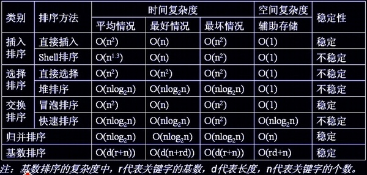


> 参考资料有：
> 真实的归宿——[八大排序算法](http://blog.csdn.net/hguisu/article/details/7776068)
> xiazdong——[九大排序算法再总结](http://blog.csdn.net/xiazdong/article/details/8462393)
> [wikipedia](https://zh.wikipedia.org/wiki/Wikipedia:首页)


