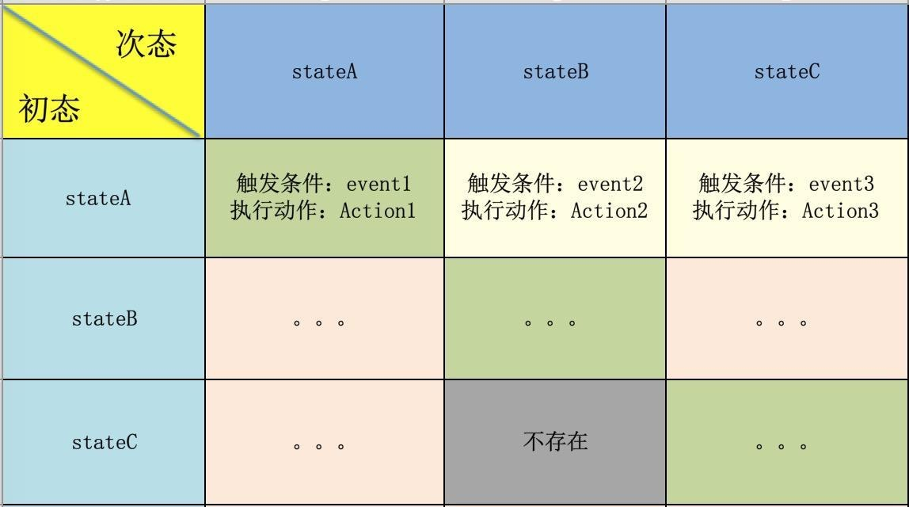

# 有限状态机在iOS中的应用
有限状态机(Finite-State Machine, FSM)，是表示有限个状态以及在这些状态之间的转移和动作等行为的数学模型。

其实我们平常和很多状态机都打过交道，比如正则表达式、网络协议（如TCP协议状态机）、游戏设计、字符串匹配等等，可能大多数时候我们都没意识到，接下来我们简略了解下状态机。

## 基本概念
- 状态(state): 指的是对象在其生命周期中的一种状况，处于某个特定状态中的对象必然会满足某些条件、执行某些动作或者是等待某些事件，而且状态是相对稳定的，如果没有外部条件的触发，一个状态会一直持续下去。
- 事件(event): 指的是对状态机来讲是有意义的那些事情。事件通常会引起状态的变迁，促使状态机从一种状态切换到另一种状态。
- 转换(transition): 指的是两个状态之间的一种关系，表明对象将在第一个状态中执行一定的动作，并将在某个事件发生的同时某个特定条件满足时进入第二个状态。
- 动作(action): 指的是状态机中可以执行的那些操作，当事件被满足或者状态变迁时执行动作，动作不是必需的。

如下图状态表：


> 关于状态机的详细知识可以参考：
> [UML状态图的实用C/C++设计](http://state-machine.com/psicc2/index.php)
> [ERLANG](http://erlang.org/doc/man/gen_fsm.html)


## 在iOS中的使用
### 背景
假设我们要设计一款网络视频播放器，有基本的播放、暂停功能，当缓冲好时可以进行播放，当URL错误或者视频资源错误时播放失败，我们发现，当我们去描述一个事物以及它的功能时，总是离不开它的状态，如这个播放器，我们可以定义它有播放失败、缓冲中、将要播放…等等状态。

### 设计
我们可以用状态机去实现这样的功能。 

- 先设定播放器可能出现的状态：

```
enum VideoPlayerState {
    case failed,           // 播放失败
         buffering,        // 缓冲中
         readyToPlay,      // 将要播放
         playing,          // 播放中
         paused,           // 播放暂停
         finished          // 播放完毕
}
```

- 然后定义当状态发生变换后，针对某个状态我希望它去执行一些逻辑里的动作

```
var state: VideoPlayerState = .paused {
    didSet {
        switch state {
            case .failed:
            // 当视频加载失败时，我希望去执行的一些事件，比如弹出提示框
            popReminderView()
            
            case .buffering:
            
            case .readyToPlay:
            
            case .playing:
            
            case .paused:
            
            case .finished:
            
        }
    }
}
```

- 在写我们的业务逻辑时，相应的去更改播放器的状态

```
// 比如我们重写网络层的一些方法，当缓冲好时准备播放
networkRequestCompletion() {

    state = .readyToPlay

}
```

这样，通过`state`我们能很清晰的知道现在播放器是什么样应该做什么事，在我们的业务逻辑中，当状态变化时通过`didSet`我们能很方便的去响应对应状态下应该执行的行为。

## 总结
整篇文章质量或许不是很高，因为还没有大量的代码实践让我去有一个更深更全的体会，但是希望能带给我自己和读者们一点抛砖引玉的效果。我们在编码、设计过程中，多去思考一些，什么地方用什么样的模式更好，比如状态机，来使我们的代码更解耦，易维护，高扩展。

> 这里有一篇关于[Objective-c状态机的实现](http://www.jianshu.com/p/5eb45c64f3e3)，更抽象，其中用到的枚举值自动转字符串通用方案很有意思，同时可以参考这篇《[iOS开发高级:使用宏定义macros](http://blog.csdn.net/songrotek/article/details/8929963)》关于宏定义的使用。
> 这篇《[iOS APP 架构漫谈二](http://studentdeng.github.io/blog/2014/11/05/ios-architecture2/)》列举了很具体的运用场景，可以参考。
> 同时参考的文章有：
> - [有限状态机](http://helloitworks.com/754.html)
> - [有限状态机（FSM）的设计与实现](http://www.cnblogs.com/chencheng/archive/2012/06/25/2562660.html)
> 
> 关于状态记的开源库推荐：
> - Objective-C: [TransitionKit](https://github.com/blakewatters/TransitionKit)
> - Swift:[SwiftTask](https://github.com/ReactKit/SwiftTask)


