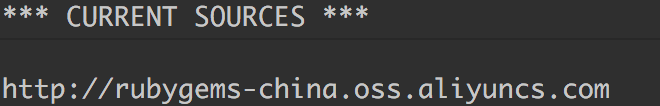
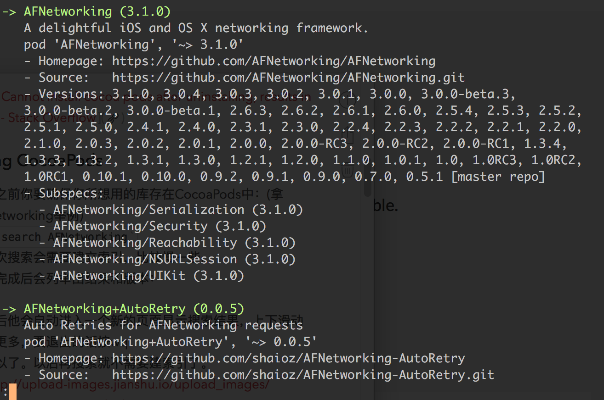

# CocoaPods 安装及一般使用
## WHAT IS [COCOAPODS](https://cocoapods.org)
CocoaPods is a dependency manager for Swift and Objective-C Cocoa projects.CocoaPods can help you scale your projects elegantly.


## INSTALL
CocoaPods是基于ruby建立的，要确保你的电脑里装有Ruby，不过Mac都是自带Ruby的，你可以用[rvm](https://rvm.io)来管理你的ruby.
>  [RVM 实用指南 · Ruby China](https://ruby-china.org/wiki/rvm-guide)   
然后我们使用Rubygem来安装cocoapods.
由于GFW的原因我们不能访问cocoapods.org，使用淘宝的Ruby镜像来代替：
1. 删除自带的Ruby镜像
`$ gem sources --remove https://rubygems.org/`
1. 添加淘宝的镜像
`$ gem sources -a https://gems.ruby-china.org/`
（如果这个镜像不能用，就用https://gems.ruby-china.org/
）
1. 可以用`$ gem sources -l`来检验。成功即显示以下结果：


1. 安装CocoaPods
`$ sudo gem install cocoapods`
1. 配置CocoaPods
`$ pod setup`

如果安装失败的话，根据报错去解决问题，比如gem没更新，ruby版本等。
常见问题：
``` ERROR:  While executing gem ... (Errno::EPERM)
    Operation not permitted - /usr/bin/xcodeproj
```
[安装Cocoapods， 更新gem出现的问题。 - SegmentFault](https://segmentfault.com/q/1010000002926243)
[ios - Cannot install cocoa pods after uninstalling, results in error - Stack Overflow](http://stackoverflow.com/questions/30812777/cannot-install-cocoa-pods-after-uninstalling-results-in-error/30851030#30851030)

## Using CocoaPods
1. 使用之前你要确保你所想用的库存在CocoaPods中：(拿AFNetworking举例)
`$ pod search AFNetworking`
第一次搜索会需要建立索引，比较慢一些。
1. 搜索完成后会列举出结果和版本：


1. 然后通过创建[Podfile](https://guides.cocoapods.org/using/the-podfile.html)文件来添加依赖关系
1. 先`cd`进你项目所在的目录(简介里面可以直接复制路径) 
2. 利用vim创建Podfile文件
`$ vim Podfile`
1. 然后输入：
```
platform :ios, '10.0'

target 'TargetName' do
pod 'AFNetworking', '~> 3.0'
end
```
> 文字的意思是，当前AFNetworking支持的iOS最高版本是iOS 10.0，’TargetName’为你项目的名称，要下载的AFNetworking版本是3.0  
保存退出。
1. 运行`$ pod install`
完成后会出现
提示使用’XXX.xcworkspace’文件来代替之前的’XXX.xcodeproj’文件打开项目。
打开项目后会发现
里面有了我们想要加进来的库，可以`#import`进来了。

1. 增加新的库
如果使用过程中我还想添加其他的库怎么办，只要在Podfile里面接着添加，然后终端再执行`pod install`就可以了。
1. 更新CocoaPods中的库
第三方库们都有人在维护升级，我们需要隔断时间就要更新下我们工程中第三方库的版本。只需要终端输入命令`pod update`就可以了。
1. 删除CocoaPods中的某些库
当我们需要去掉某个第三方库时，只需要在Podfile删除该引入该库的语句，然后执行`pod update`或者`pod install`就可以了。
1. 升级CocoaPods
`sudo gem install cocoapods`


